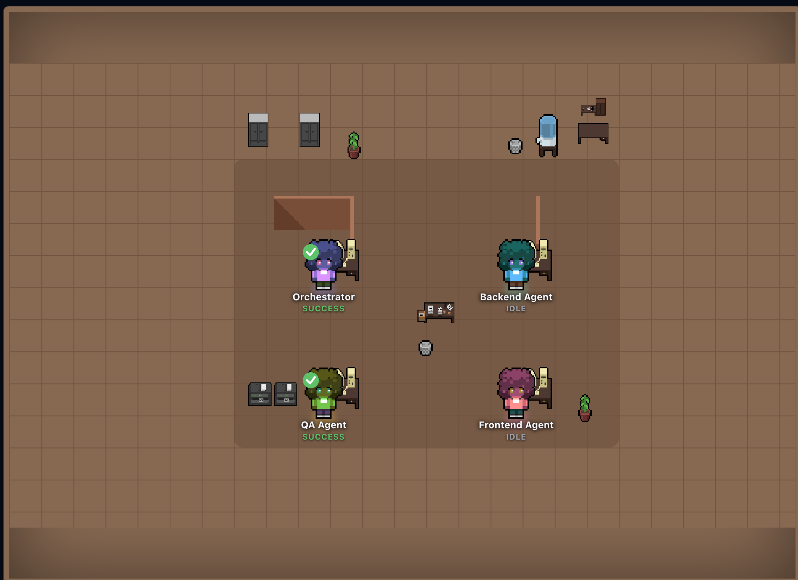

# Multi-Agent Strands

Multi-agent software development system that automates Jira ticket handling using the Strands Agents SDK. Agents analyze tickets, generate code, run tests, and open PRs — a human always reviews before merge.



---

## Architecture


| Layer | Stack |
|-------|-------|
| Frontend | React + Vite + TypeScript, Socket.IO |
| Backend | FastAPI + Strands Agents SDK, python-socketio |
| Database | PostgreSQL 16 + SQLAlchemy + asyncpg |
| LLM | MiniMax M2.7 via OpenAI-compatible API |
| MCP | `mcp-atlassian` (Jira), `github-mcp-server` |
| Infra | Docker Compose |

**Agents:**
- **Orchestrator** — reads Jira tickets, delegates tasks, coordinates the pipeline
- **Backend Agent** — FastAPI endpoints, Pydantic models, SQLAlchemy models
- **Frontend Agent** — React components, pages, TypeScript
- **QA Agent** — writes and runs tests (pytest, Vitest)

---

## Quick Start

### Prerequisites

- Node.js 18+, Python 3.12+, Docker Compose

### 1. Configure environment

```bash
cp .env.example .env
```

Required variables: `DATABASE_URL`, `LLM_API_KEY`, `JIRA_URL`, `JIRA_API_TOKEN`, `JIRA_EMAIL`, `GITHUB_TOKEN`, `VITE_SOCKET_URL`

### 2. Start services

```bash
docker compose up -d
```

| Service | URL |
|---------|-----|
| Frontend | http://localhost:3000 |
| Backend | http://localhost:8000 |
| API Docs | http://localhost:8000/docs |

### 3. Run migrations

```bash
docker compose exec backend alembic upgrade head
```

---

## Common Commands

### Docker

```bash
docker compose up -d                    # Start all services
docker compose down                     # Stop (preserves data)
docker compose down -v                  # Stop + wipe volumes
docker compose logs -f backend          # Stream backend logs
docker compose restart backend          # Restart one service
docker compose up -d --build backend   # Rebuild after dep changes
```

### Backend

```bash
cd backend
python -m venv .venv && source .venv/bin/activate
pip install -r requirements.txt
uvicorn app.main:app --reload --port 8000
```

| Command | Description |
|---------|-------------|
| `pytest` | Run tests |
| `pytest --cov=. --cov-report=html` | Coverage |
| `ruff check . && ruff format .` | Lint + format |
| `mypy .` | Type check |

### Frontend

```bash
cd frontend && npm install && npm run dev
```

| Command | Description |
|---------|-------------|
| `npm test` | Run tests |
| `npm run lint` | Lint |
| `npx tsc --noEmit` | Type check |

---

## Database Migrations

```bash
# Check status
alembic current && alembic history

# Apply pending
alembic upgrade head

# New migration after model changes
alembic revision --autogenerate -m "description"

# Rollback one
alembic downgrade -1
```

---

## Project Structure

```
multi-agent-strands/
├── frontend/          # React + Vite + TypeScript
├── backend/           # FastAPI + Strands Agents SDK
├── openspec/          # Specification-driven workflow
├── docs/              # Architecture diagrams and planning
├── docker-compose.yml
└── .env.example
```

---

## OpenSpec Workflow

```bash
/opsx:explore    # Think through ideas before committing
/opsx:propose    # Create a change with proposal + tasks
/opsx:apply      # Implement tasks from a change
/opsx:archive    # Finalize completed changes
```

---

## Debugging Jira

Get an API token at: https://id.atlassian.com/manage-profile/security/api-tokens

```bash
# Search tickets by status
curl -s -X GET \
  -H "Authorization: Basic $(echo -n 'EMAIL:TOKEN' | base64)" \
  -H "Accept: application/json" \
  "https://YOUR_DOMAIN.atlassian.net/rest/api/3/search/jql?jql=status='To Do'&maxResults=5"

# Get a single ticket
curl -s -X GET \
  -H "Authorization: Basic $(echo -n 'EMAIL:TOKEN' | base64)" \
  -H "Accept: application/json" \
  "https://YOUR_DOMAIN.atlassian.net/rest/api/3/issue/TICKET-KEY"
```

If the MCP connection fails, verify `JIRA_URL`, `JIRA_EMAIL`, and `JIRA_API_TOKEN` in `.env`.
